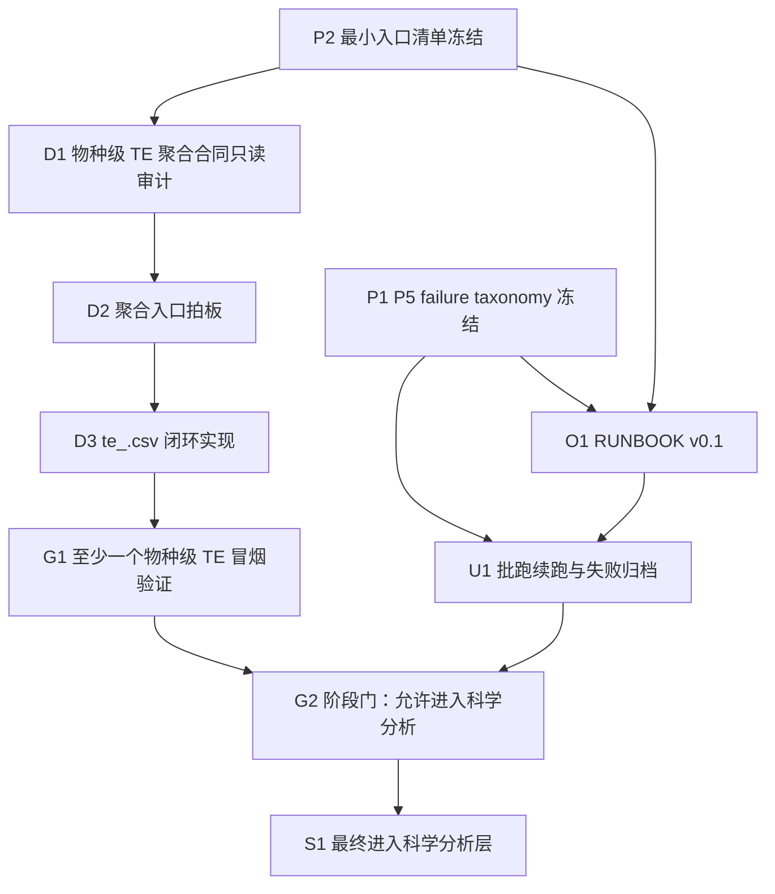

# te_analysis 下一阶段主规划

本文档基于当前仓库的只读审计结果撰写，目标不是回顾历史，而是回答一个更直接的问题：

> 从当前真实状态出发，`te_analysis` 下一阶段应该先做什么，按什么依赖顺序做，每个任务的输入/处理逻辑/输出是什么，哪些是事实，哪些只是推断，哪些必须继续审计。

审计边界：

- 仅使用当前仓库中的代码、文档、日志、现有产物和路径状态。
- 不把旧印象写成事实。
- 当仓库现证据与既有口径冲突时，以当前仓库证据为准，并在文档中显式标注冲突。

---

## 已验证事实

1. 要求优先检查的规划文档均存在：`docs/progress_snapshot.md`、`docs/backlog.md`、`docs/te_analysis_top_level_design_v1.md`、`docs/te_analysis_module_contracts_v1.md`、`docs/te_analysis_sprint_plan_v1.md`、`docs/p5_postmortem/SUMMARY.md`；仓库根目录下的 `output/` 目录未找到。
2. 当前主动代码入口实际存在：`src/te_analysis/stage_inputs.py`、`src/te_analysis/run_upstream.py`、`src/te_analysis/run_downstream.py`、`Makefile`、`scripts/run_p5_batch.sh`。
3. 当前仓库未找到面向用户的 `RUNBOOK` 文档；`README.md` 只有极简 `Quickstart`，`docs/reproducibility.md` 仍写着 `TODO(T13)`。
4. `docs/architecture.md` 与 `docs/reproducibility.md` 仍写有 “upstream/downstream not yet implemented” 一类旧表述，但当前仓库已经存在 `run_upstream.py`、`run_downstream.py`，且存在 `logs/t9_run_downstream.log` 这样的真实运行日志，说明文档与现状存在漂移。
5. `data/processed/te/` 下当前只有 `GSE105082` 的 study 级输出：`homo_sapiens_TE_cellline_all.csv`、`homo_sapiens_TE_cellline_all_T.csv`、`homo_sapiens_TE_sample_level.rda`。
6. 全仓库未找到任何 `te_*.csv` 文件；也未找到任何物种级命名的 `te_<organism>.csv` 成品。
7. `src/te_analysis/run_downstream.py` 当前只做三件事：按 study 写 `vendor/TE_model/trials/{study}/config.py`，调用 `bash pipeline.bash -t {study}`，把 `human_TE_*` 三个产物按 `organism` 重命名后复制到 `data/processed/te/{study}/`；代码里没有物种级聚合逻辑。
8. `vendor/TE_model/pipeline.bash` 的真实阶段是固定的 0 到 3：`trials.{trial}.config`、`ribobase_counts_processing.py`、`TE.R`、`transpose_TE.py`。
9. `vendor/TE_model/src/ribo_counts_to_csv.py` 的 Stage 0 同时从同一个 `.ribo` 文件中提取 ribo counts 和 RNA-seq counts；下游并不需要额外的 RNA 原始文件契约。
10. `vendor/TE_model/src/ribo_counts_to_csv.py` 会扫描 `./data/ribo/*/ribo/experiments/*.ribo`，再按 `custom_experiment_list` 过滤；因此 vendor Stage 0 在代码层面并不天然限制为单 study。
11. `vendor/TE_model/src/TE.R` 最终按 `data/infor_filter.csv` 中的 `experiment_alias -> cell_line` 做分组均值，输出 `human_TE_cellline_all.csv`；vendor 终点是 cell line 级，不是 organism 级。
12. `vendor/TE_model/trials/` 下当前只有两个真实 trial 目录：`GSE105082` 和 `PAX_hela`；未找到任何物种级 trial、sample-list 驱动的聚合示例或 `te_<organism>.csv` 示例。
13. `logs/t9_run_downstream.log` 记录了 `GSE105082` 的一次真实下游正向运行，并显示 `run_downstream` 最终复制了 3 个产物到 `data/processed/te/GSE105082`。
14. 当前下游正向样例并非完全自给于本仓：`vendor/TE_model/data/ribo/GSE105082` 是一个符号链接，目标是仓库外路径 `/home/xrx/my_project/project/workflow/snakescale/output/GSE105082`。
15. `scripts/run_p5_batch.sh` 当前是一个硬编码批跑脚本：固定 Python 解释器、固定 `snakemake` 路径、固定 inventory、固定 `timeout 7200`、固定先调用 `scripts/prepare_rna_stub.py`。
16. `logs/p5/batch_master.log` 显示本轮 P5 实际进入批跑的 study 数是 14；其中 10 个被脚本记为 `SUCCESS`，3 个被记为 `FAILED`，`GSE123564` 只出现了 “Starting” 但没有最终结尾。
17. 当前仓库中真正存在的 `vendor/snakescale/output/*/ribo/all.ribo` 只有 4 个：`GSE109122`、`GSE125086`、`GSE50597`、`GSE65885`。
18. 当前仓库中 `vendor/snakescale/log/riboflow_status/*/riboflow_status.txt` 明确显示成功的只有 `GSE109122`、`GSE125086`、`GSE50597`、`GSE65885`；`GSE105082`、`GSE112705`、`GSE132441`、`GSE43703`、`GSE64962`、`GSE69602` 均显示 `failed`。
19. 因此，先前“P5 + P4 共 5 个 `.ribo`，其中包含 `GSE64962`”这一口径，已被当前仓库证据推翻；就当前仓库可见证据而言，P5 真正可见 `.ribo` 成功是 4 个，P4 另有 `GSE125086`。
20. 当前未找到任何 machine-readable 的失败归档文件来记录 `fail_class / fail_code / action`；现有失败信息散落在 `logs/p5/*.log`、`vendor/snakescale/log/riboflow_status/*` 和 `docs/p5_postmortem/*.md` 中。

---

## 当前推断

1. “单链路可跑、批量不稳、最终聚合未闭环” 这个总判断基本成立，但“单链路可跑”目前更准确地说是：存在 study 级正向样例，且至少一条下游正向样例依赖仓外 `.ribo` 符号链接。
2. 当前真正阻碍用户使用项目的，不是完全没有入口，而是入口分裂且隐性前置过多：`Makefile`、批跑脚本、stub 预处理、sqlite DB、外部符号链接、tmux 约束都没有被一份可执行说明统一收束。
3. 当前项目的“成功判据”过去被错误放大为 `snakemake exit=0`；下一阶段若不先冻结失败 taxonomy 和成功判据，继续批跑只会继续制造口径污染。
4. `GSE64962` 很可能应被归入“预裁剪/adapter 无法确定”一类，而不是“真实 `.ribo` 成功”一类；但正式冻结前仍应保留为“当前推断已强烈倾向”。
5. 物种级 TE 聚合的主要阻塞并不是“缺一段计算代码”，而是“vendor 当前到底支持什么输入合同、最终分组轴是什么、应不应该跨 study 做一个 trial”尚未拍板。
6. 继续推进剩余 study 与继续扩数据收集仍然是合理方向，但它们不应该先于 taxonomy 冻结、最小入口冻结和 RUNBOOK 补齐。
7. 当前公开入口 `make all STUDY=<GSE>` 不是稳定的“用户最小可用入口”；它更像开发者入口，因为它没有暴露当前真实的前置依赖和失败判据。
8. 下一阶段最稳妥的主路线应是“先稳定事实与操作，再闭合聚合，再恢复规模化推进”，而不是立即把重点放在继续跑更多 study 上。

---

## 待审计问题

1. `GSE105082` 这条下游正向样例，是否能够在完全不依赖仓外路径的情况下，在当前仓库内部复现一次端到端正向链路。
2. 当前 4 个可见 `.ribo` 成功 study 中，哪些能够被当前 `vendor/TE_model` 路径直接消费，哪些还需要额外符号链接或目录整理。
3. 目标产物 `te_<organism>.csv` 的“分组轴”到底是什么：物种内总体、物种内 cell line、物种内 study 汇总，还是别的定义。
4. 物种级 TE 应该通过哪条技术路径实现：一个跨 study 的 vendor trial、多个 study 级结果再聚合、扩现有 wrapper、扩配置，还是新增脚本。
5. `vendor/TE_model/data/infor_filter.csv` 的 `cell_line` 分组合同，对植物、线虫等非 human study 是否仍可用，还是必须投影/重写为新的 trial-local 映射。
6. `vendor/TE_model/src/ribobase_counts_processing.py` 中的 `nonpolyA_gene.csv` 与 `apris_human_alias` 相关假设，对非 human 物种是否构成方法学阻断。
7. 批跑辅助脚本所依赖的 sqlite DB 路径到底应该冻结为哪一个：当前 helper 使用的 `data/processed/snakescale_input.db`，还是构建脚本文档里提到的 `db/` 产物路径。
8. 批跑状态与失败归档应如何落盘，才能避免 `vendor/snakescale/log/status.txt`、`valid_studies.txt` 这类“会被后一次运行覆盖”的状态文件继续污染审计。

---

## 第一性原理拆解

### 1. 当前工程最小问题是什么

当前工程上真正要解决的最小问题，不是“再跑更多 study”，而是：

> 把 `te_analysis` 从“开发者记忆驱动的 study 级实验壳”推进成“用户可操作、失败可归档、能把已验证 `.ribo` 稳定转成物种级 TE 产物”的 TE-only 系统。

这件事至少包含三个子问题：

- 上游失败必须被分型，而不是继续混成“FAILED”。
- 用户入口必须被收束，否则工具存在但不可操作。
- 下游终点必须从“某个 study 的 `*_TE_cellline_all_T.csv`”推进到“物种级 `te_<organism>.csv`”。

### 2. 当前阶段的关键产物是什么

| 产物 | 当前状态 | 为什么现在必须优先 |
|---|---|---|
| `.ribo` | 当前仓库可见成功只有 4 个 P5 + 1 个 P4 历史成功 | 它是上游真实成功的最小中间物，不是最终科学产物 |
| `te_<organism>.csv` | 未找到 | 这是从“study 级试运行”进入“物种级分析”的必要门槛 |
| `RUNBOOK` | 未找到 | 没有它，用户无法独立操作 pipeline |
| failure registry | 未找到 machine-readable 版本 | 没有它，继续批跑只会继续制造口径污染 |

### 3. 为什么这四类产物之间存在依赖关系

- 没有 `.ribo`，下游无从谈起。
- 没有 failure registry，`.ribo` 的“成功/失败”边界会继续失真。
- 没有 RUNBOOK，`.ribo` 和后续聚合都只停留在“开发者本人知道怎么跑”的状态。
- 没有 `te_<organism>.csv`，项目就仍然停在“study 级中间结果”而没有进入科学分析层。

因此，四类产物的依赖关系不是线性的“先算再说”，而是：

- failure registry 决定什么算真实成功；
- RUNBOOK 决定真实成功如何被别人复用；
- `.ribo` 提供真实下游输入；
- `te_<organism>.csv` 才是下一阶段真正要交付的分析入口。

### 4. 为什么“继续跑更多 study”不是当前唯一正确动作

因为当前有三个基础问题尚未解决：

- 成功判据刚被尸检推翻，继续跑只会继续把 `exit=0` 和真实成功混淆。
- 用户入口没有冻结，继续跑出的路径和手法不可复用。
- 物种级 TE 聚合合同尚未拍板，就算继续积累 `.ribo`，也未必能进入科学分析。

所以，“继续跑更多 study”是后续必要动作，但不是下一阶段的起手动作。

---

## 主矛盾与依赖关系

| 主矛盾 | 当前表现 | 先决条件 | 可并行性 | 进入下一步的门槛 |
|---|---|---|---|---|
| 批跑稳定性问题 | P5 结果口径漂移；运行时失败与 QC 失败混类；状态文件会被覆盖 | 先冻结 failure taxonomy | 可与聚合合同只读审计并行，但不宜先于 taxonomy 冻结继续批跑 | 必须先有 machine-readable 失败归档 |
| 用户不可操作问题 | 入口分散；文档漂移；关键前置未写明；最小成功判据不统一 | 先冻结最小入口清单 | 可与 failure taxonomy 冻结并行推进 | 必须先产出 RUNBOOK v0.1 |
| 物种级聚合未闭环问题 | 只有 study 级 `*_TE_*`；没有 `te_<organism>.csv`；vendor 终点是 cell line 级 | 先做只读审计，不能先假定新脚本 | 可在 RUNBOOK 编写期间并行做只读合同审计 | 必须先完成“聚合入口拍板” |

依赖关系可压缩成一句话：

> 先把“失败怎么记、入口是什么、用户怎么跑”固定下来，再决定“多个 `.ribo` 究竟怎样变成物种级 TE 文件”，最后才恢复批跑规模和进入科学分析。

---

## 下一阶段开发总路线

推荐主路线：**稳态闭环优先**。

路线原则：

- 先纠正成功/失败口径，再继续扩批。
- 先冻结最小入口并补 RUNBOOK，再把“用户会不会用”这个软肋补掉。
- 先只读审计 `run_downstream.py` 与 `vendor/TE_model` 的真实合同，再决定聚合入口。
- 在至少一个物种级 `te_<organism>.csv` 冒烟通过之前，不进入科学分析层。

这条路线服务的三个核心主题不变：

1. `P5 failure taxonomy`
2. `RUNBOOK`
3. `物种级 TE 聚合闭环`

---

## 任务 DAG

说明：

- `P1` 与 `P2` 是第一优先级起点。
- `D1` 是只读审计任务，可以在 `O1` 编写期间并行推进。
- `U1` 不应先于 `P1` 与 `O1`。
- `S1` 必须同时等待“物种级闭环已冒烟”和“批跑已按 taxonomy 归档”。

---

## 分层任务表

| 层 | 任务 ID | 核心任务 | 输入数据结构 | 处理逻辑 | 预期输出 |
|---|---|---|---|---|---|
| P | P1 | 冻结 P5 failure taxonomy | `logs/p5/*.log`、`vendor/snakescale/log/riboflow_status/*`、`docs/p5_postmortem/*.md` | 逐 study 归入 `A/B/C/D` 四大类，补唯一 `fail_code`，为每类绑定默认 `action`，解决 `GSE64962` 这类口径冲突 | 一份 machine-readable 失败注册表，至少含 `study / fail_class / fail_code / action / evidence_path / status` |
| P | P2 | 冻结最小入口清单 | `README.md`、`Makefile`、`src/te_analysis/*`、`scripts/run_p5_batch.sh`、辅助脚本、外部符号链接现状 | 明确单 study 入口、批跑入口、下游验证入口分别是什么，各自前置条件、成功信号、失败信号是什么 | 一份“最小入口清单”基线，供 RUNBOOK 直接引用 |
| O | O1 | 编写 RUNBOOK v0.1 | `P1` 失败注册表、`P2` 入口清单、当前路径约定、P5 尸检结论 | 把“如何准备、如何执行、如何判定成功、如何记录失败、如何续跑”写成用户可执行步骤 | `RUNBOOK v0.1` 文档，覆盖单 study、批跑、下游和失败归档 |
| D | D1 | 物种级 TE 聚合合同只读审计 | `src/te_analysis/run_downstream.py`、`vendor/TE_model/README.md`、`pipeline.bash`、`src/*.py`、`trials/*`、`data/infor_filter.csv` | 只读确认 `.ribo -> Stage0 -> Stage1/2/3 -> final CSV` 的最小输入合同，识别 vendor 天然支持与天然不支持的部分 | 一份“物种级聚合最小输入合同”，明确已知项与未知项 |
| D | D2 | 聚合入口拍板 | `D1` 合同审计结果、现有 `.ribo` 存量、现有 `run_downstream.py` 设计 | 在“扩 wrapper / 扩配置 / 新增聚合脚本”三类方案中做工程决策，但不预设答案 | 一份聚合实现决策记录，明确选型、拒绝项、理由 |
| D | D3 | 打通 `te_<organism>.csv` 闭环 | `D2` 决策、至少一个可消费物种的 `.ribo` 集合、必要的 metadata / mapping 投影 | 按拍板路径实现从多个 `.ribo` 到物种级 CSV 的可重复通路 | 至少一个 `te_<organism>.csv` 成功落地的实现路径 |
| G | G1 | 至少一个物种级 TE 冒烟验证 | `D3` 产物、输入 `.ribo` 列表、期望 shape / grouping 约束 | 做最小范围冒烟，确认输入可读、输出非空、分组轴符合拍板定义 | 一次通过的物种级冒烟记录，含输入清单、输出路径、成功判据 |
| U | U1 | 批跑续跑与失败归档 | `P1` taxonomy、`O1` RUNBOOK、剩余 study inventory、当前 helper 脚本 | 继续推进未跑 study，同时把新旧失败统一归档到 machine-readable 注册表，不再只留文本日志 | 续跑结果 + 归档后的失败注册表更新版 |
| G | G2 | 阶段门：允许进入科学分析 | `G1` 冒烟结果、`U1` 归档结果、`RUNBOOK v0.1` | 检查是否同时满足“物种级闭环已通”“批跑结果已可解释”“用户入口已可操作” | 一份阶段门结论：通过或不通过 |
| S | S1 | 进入科学分析层 | `G2` 通过后的物种级 CSV 集合 | 在已冻结的工程入口与归档口径上开展统计与生物学分析 | 科学分析输入基线，而不是继续修改工程主链 |

---

## 关键任务逐项拆解

### 1. P5 failure taxonomy

这不是“补一张表”，而是纠正整个项目的成功/失败语言。

当前证据支持的 study 映射如下：

| study | 当前建议类别 | 证据等级 | 当前动作建议 |
|---|---|---|---|
| `GSE100007` | A. 大文件 cutadapt pipe 竞争 | 已验证 | 归入 `A`，后续按大文件策略处理 |
| `GSE123018` | A. 大文件 cutadapt pipe 竞争 | 已验证 | 归入 `A`，后续按大文件策略处理 |
| `GSE43703` | B. 预裁剪/adapter 低命中 | 已验证 | 归档，不强行救 |
| `GSE132441` | B. 预裁剪/adapter 低命中 | 已验证 | 归档，不强行救 |
| `GSE69602` | B. 预裁剪/adapter 低命中 | 已验证 | 归档，不强行救 |
| `GSE112705` | B. 预裁剪/adapter 低命中 | 已验证 | 归档，不强行救 |
| `GSE105082` | B. 预裁剪/adapter 低命中 | 已验证 | 归档，不强行救 |
| `GSE64962` | B. 预裁剪/adapter 低命中 | 当前推断，证据很强 | 在 registry 中标为“待冻结前复核” |
| `GSE48140` | C. db organism 多值污染 | 已验证 | 归入 `C`，单独修数据库合同 |
| `GSE56924` | D. 流程/运行时问题 | 已验证 | 归入 `D`，属于 staging/symlink 问题 |
| `GSE123564` | D. 流程/运行时问题 | 已验证 | 归入 `D`，属于 session/SIGTERM 问题 |

P1 完成标准：

- 不再使用“SUCCESS but no `.ribo`”这种混合语言。
- 不再把 `snakemake exit=0` 当最终成功信号。
- 所有后续批跑结果必须先写入失败注册表，再写结论。

### 2. RUNBOOK

RUNBOOK v0.1 必须回答的不是“理想情况下怎么跑”，而是“按当前仓库现实，用户最少要知道什么才不会踩坑”。

最少应覆盖：

- 单 study 上游入口：输入什么、运行什么、看哪里算成功。
- 单 study 下游入口：当前正向样例是什么、哪些路径仍依赖仓外符号链接。
- P5 批跑入口：必须在 `tmux/screen` 中运行、哪些 helper 脚本会被调用、成功与失败如何记录。
- 失败归档规则：什么时候写 `fail_class`，什么时候只写 `audit_needed`。
- 明确禁止事项：不把 QC reject 伪装成 runtime 修复目标，不把 `exit=0` 当 `.ribo` 成功。

RUNBOOK 不应该再继续分散在：

- `README.md` 的 3 行 quickstart
- `docs/reproducibility.md` 的 TODO
- `progress_snapshot` 的交接文字
- AI memory

### 3. 物种级 TE 聚合闭环

当前只读审计已经确认了三件关键事实：

1. Stage 0 的最小真实输入是“可访问的 experiment 级 `.ribo` 文件 + `custom_experiment_list`”。
2. Stage 0 可以跨多个 study 扫描 `data/ribo/*/ribo/experiments/*.ribo`。
3. vendor 最终分组轴是 `cell_line`，不是 `organism`。

这意味着：

- “跨 study 做一个 trial”在代码层面并非不可能。
- 但“直接得到 `te_<organism>.csv`”并不是 vendor 的原生终点。
- 聚合闭环的核心问题不是算不算得动，而是“分组语义怎么定义”。

因此，D1 必须先把下面这张最小合同表补齐：

| 合同项 | 当前已验证 | 当前未定 |
|---|---|---|
| `.ribo` 输入路径 | `data/ribo/*/ribo/experiments/{experiment}.ribo` 或等价符号链接 | 是否必须全部迁回本仓内部 |
| 试验选择机制 | `custom_experiment_list` | 是否需要 study-level manifest |
| 分组映射 | `data/infor_filter.csv` 的 `experiment_alias -> cell_line` | 物种级输出应按什么轴聚合 |
| 最终文件命名 | vendor 产出 `human_TE_*`，wrapper 可重命名 | `te_<organism>.csv` 的最终命名与列/行语义 |

在 D1 完成之前，不能先假定必须写 `aggregate_te_by_species.py`。

---

## 方案比较：优势 / 劣势 / 风险

### 方案 A：稳态闭环优先

定义：先做 `taxonomy -> 入口清单 -> RUNBOOK -> 聚合合同审计 -> 一个物种闭环 -> 再续跑批量`。

优势：

- 能先修复当前最严重的口径污染。
- 能把“用户不会用”这个软肋优先补上。
- 能在真正理解聚合合同之后再决定是否需要新代码。

劣势 / 风险：

- 短期内新增 `.ribo` 数量增长会变慢。
- 需要忍住“不先继续跑”的冲动。

置信度评级：高

### 方案 B：批跑优先

定义：先继续把剩余 study 跑完，再回头补 taxonomy、RUNBOOK 和聚合。

优势：

- 短期内可以更快积累更多 `.ribo` 候选。
- 对“数据量焦虑”最直接。

劣势 / 风险：

- 失败口径会继续污染。
- 用户入口仍然不可用，别人无法复现。
- 就算积累了更多 `.ribo`，聚合闭环没拍板也进不了科学分析。

置信度评级：低

### 方案 C：聚合优先

定义：先围绕现有 4 个 `.ribo` 直接实现物种级 `te_<organism>.csv`，后补 RUNBOOK 和 taxonomy。

优势：

- 能最快验证“最终科学产物是否真的能落地”。
- 对项目终点最聚焦。

劣势 / 风险：

- 现有输入合同仍有关键未定项，尤其是 grouping axis 与 non-human 适配。
- 如果先写实现，后续很可能因为合同重判而返工。
- 会掩盖“用户不会跑”和“失败不可解释”的系统性问题。

置信度评级：中

结论：

> 推荐方案 A。  
> 方案 B 当前风险过高。  
> 方案 C 可以作为方案 A 中 `D1 -> D2 -> D3` 的局部加速目标，但不应替代方案 A。

---

## 推荐执行顺序

1. 先冻结 `P5 failure taxonomy`，并用当前仓库证据修正 `GSE64962` 的旧口径。
2. 立刻冻结“最小入口清单”，把单 study、批跑、下游验证三个入口的前置条件和成功信号写死。
3. 基于前两步补 `RUNBOOK v0.1`，解决“工具造出来但用户不会用”的软肋。
4. 并行开展 `run_downstream.py + vendor/TE_model` 的物种级聚合合同只读审计。
5. 在合同审计后拍板聚合入口：扩 wrapper、扩配置，还是新增聚合脚本。
6. 打通至少一个物种级 `te_<organism>.csv`，并完成一次最小冒烟验证。
7. 按 frozen taxonomy 继续批跑与失败归档，不再混用文本日志与口头判断。
8. 只有在“物种级闭环已过冒烟 + 批跑失败已可解释 + RUNBOOK 已可执行”同时满足后，才进入科学分析层。

---

## 当前禁止事项 / 反模式

- 禁止再把 `snakemake exit=0` 写成“成功”。
- 禁止把 QC reject、db 污染、symlink/staging、session/SIGTERM 混成一个 `FAILED`。
- 禁止在 `run_downstream.py` 与 `vendor/TE_model` 合同未审清前，直接预设必须新写 `aggregate_te_by_species.py`。
- 禁止把当前仓外符号链接支撑起来的正向样例，当成“本仓已完全自给闭环”。
- 禁止在没有 RUNBOOK 的情况下，把 `make all` 当作稳定的用户入口。
- 禁止为了追求成功率去强行救被 QC 打掉的 study。
- 禁止把当前“4/14 的即时真实产物成功率”外推成最终数据可用率。
- 禁止继续只留 postmortem 文字，不落 machine-readable `fail_class / fail_code / action`。

---

## 结论

从当前真实状态出发，`te_analysis` 的下一阶段不应以“继续多跑几个 study”为起手，而应以“冻结失败语言、冻结入口、补 RUNBOOK、审计聚合合同”为起手。

只有这样，后续“批跑续跑”和“物种级 `te_<organism>.csv` 闭环”才会真正站在稳定地基上，而不是继续堆在口径漂移和操作隐性知识上。
